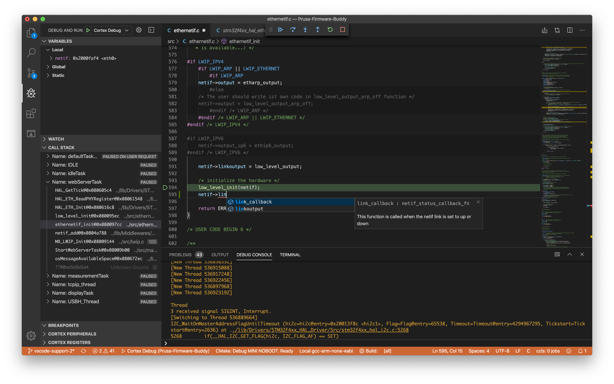

### Development using Visual Studio Code



1. In Visual Studio Code, install the following extensions:
    - `CMake Tools` (handles configuring and building the project),
    - `Cortex-Debug` and `Cortex-Debug: Device Support Pack - STM32F4` (support for debugging of the firmware),
    - and `ccls` extension, which provides autocompletion and code navigation.
2. Install [ccls](https://github.com/MaskRay/ccls) on your system
    - Linux: `sudo snap install ccls --classic` ([full instructions](https://snapcraft.io/ccls))
    - Mac: `brew install ccls`
    - Windows:
        1. Download our precompiled binaries from [here](https://prusa-buddy-firmware-dependencies.s3.eu-central-1.amazonaws.com/windows_tools.zip).
        2. Unzip them to `C:\Tools` so your file structure looks like this:

            ```
            C:\Tools
             ├── LLVM
             └── lsp-ccls
            ```

        3. Add the path to the `ccls` binary to your Visual Studio Code's settings:
            1. Ctrl+Shift+P and `Preferences: Open Settings (JSON)`
            2. Add the following to the JSON.

                ```JSON
                "ccls.launch.command": "c:\\Tools\\lsp-ccls\\bin\\ccls.exe",
                ```

3. Install OpenOCD
    - Linux: `sudo apt install openocd`
    - Mac: `brew install openocd`
    - Windows:
        1. Download the latest version from [here](https://gnutoolchains.com/arm-eabi/openocd).
        2. Extract the content to some permanent location.
        3. In vscode, Ctrl+Shift+P and `Preferences: Open Settings (JSON)`
        4. Add the following line with appropriate path the openocd executable.

            ```json
            "cortex-debug.openocdPath": "c:\\Path\\To\\openocd.exe"
            ```

3. In Visual Studio Code, open the directory with this repository.
